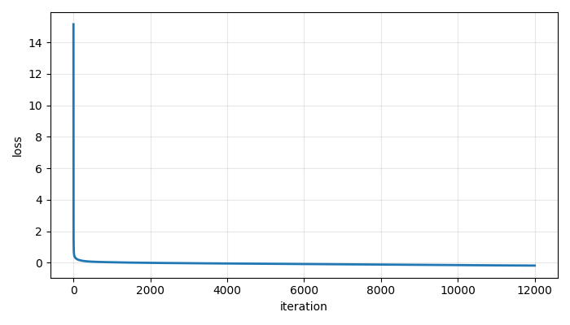

# ProbNN — Probabilistic Neural Network for Regression with Uncertainty

**ProbNN** is a **from-scratch probabilistic neural network** implemented in pure Python and NumPy, designed for **regression with heteroscedastic uncertainty**.  
The project emphasizes **mathematical clarity**, **explicit backpropagation**, and **likelihood-based training**, making it suitable for **scientific computing**, **machine learning engineering**, and **uncertainty-aware modeling**.

This repository demonstrates deep understanding of:
- Neural Networks (forward / backward pass)
- Gradient-based optimization
- Probabilistic modeling
- Gaussian likelihoods
- Numerical stability
- Model calibration

---

## Problem Definition

Given a regression dataset with observational uncertainty:

\[
\mathcal{D} = \{(x_i, y_i, \delta y_i)\}_{i=1}^N
\]

the goal is to learn a **predictive distribution**, not just a point estimate:

\[
p(y \mid x, \mathcal{D}) = \mathcal{N}\big(\mu(x), \ \delta y^2 + \sigma^2(x)\big)
\]

where:
- \( \mu(x) \) is the predictive mean,
- \( \sigma(x) \) is the **model uncertainty**, learned directly by the neural network,
- \( \delta y \) represents known observational noise.

This formulation is critical in **real-world regression problems**, where uncertainty is intrinsic to the data.

---

## Neural Network Architecture

ProbNN implements a **fully connected feedforward neural network** composed of:

### 1. Shared Trunk (Feature Extractor)

A sequence of dense layers:

\[
z^{(l)} = W^{(l)} a^{(l-1)} + b^{(l)}, \quad
a^{(l)} = \phi(z^{(l)})
\]

where \( \phi \) is a nonlinear activation function (Tanh, ReLU).

### 2. Dual Output Heads

The network branches into two heads:

- **Mean head**
\[
\mu(x) = h(x)^\top W_\mu + b_\mu
\]

- **Log-variance proxy head**
\[
s(x) = h(x)^\top W_s + b_s
\]

To ensure numerical stability and positivity of the standard deviation:

\[
\sigma(x) = \text{softplus}(s) = \log(1 + e^s)
\]

---

## Activation Functions and Backpropagation

Each activation function explicitly defines:

- **Forward pass**
- **Backward pass (derivative)**

Example (Tanh):

\[
\phi(z) = \tanh(z), \quad
\frac{d\phi}{dz} = 1 - \tanh^2(z)
\]

During training, gradients flow backward through:
- output heads,
- dense layers,
- activation derivatives,

via the **chain rule**, forming the core of **backpropagation**.

This project does **not** rely on automatic differentiation frameworks — all gradients are computed explicitly.

---

## Probabilistic Loss Function

Training minimizes the **Gaussian Negative Log-Likelihood (NLL)**:

\[
\mathcal{L} =
\frac{1}{2N} \sum_{i=1}^N
\left[
\frac{(y_i - \mu_i)^2}{\delta y_i^2 + \sigma_i^2}
+ \log(\delta y_i^2 + \sigma_i^2)
\right]
\]

Additional regularization terms:
- **Variance regularization** to avoid collapse:
\[
\lambda_\sigma \langle s^2 \rangle
\]
- **L2 weight decay** for numerical stability.

This loss tightly couples:
- prediction accuracy,
- uncertainty estimation,
- numerical robustness.

---

## Optimization Strategy

Parameters are optimized using **gradient descent (SGD)**:

\[
\theta \leftarrow \theta - \eta \nabla_\theta \mathcal{L}
\]

Key properties:
- Gradients computed analytically
- Local updates per parameter
- Stable convergence under noisy and discontinuous targets

---

## Model Diagnostics: Normalized Residuals

Calibration is evaluated using **normalized residuals**:

\[
r_i =
\frac{y_i - \mu(x_i)}
{\sqrt{\delta y_i^2 + \sigma(x_i)^2}}
\]

For a well-calibrated probabilistic model:

\[
r_i \sim \mathcal{N}(0, 1)
\]

This provides a **statistical validation** of uncertainty estimates.

---

## Example: Discontinuous Regression Benchmark

This example demonstrates the framework’s ability to handle:
- sharp discontinuities,
- smooth global trends,
- extrapolation,
- numerical instability risks.

### Predictive Fit (Benchmark View)


**Interpretation:**
- The network captures global structure.
- Predictive uncertainty increases near the discontinuity.
- Extrapolation uncertainty grows outside data support.

---

### Training Loss Convergence



**Interpretation:**
- Stable optimization despite non-smooth target.
- No divergence or numerical collapse.
- Smooth convergence under probabilistic loss.

---

### Normalized Residuals


**Interpretation:**
- Residuals approximately follow a standard normal distribution.
- Indicates correct uncertainty calibration.
- Confirms consistency between likelihood and predictions.

---

## Project Structure

```

ProbNN/
├── activation.py     # Activation functions + derivatives
├── nn.py             # Training, backpropagation, prediction
├── utils.py          # Numerical utilities, plots, diagnostics
├── examples.py       # Benchmark experiments
├── main.py           # Entry point
├── plots/            # Generated figures
├── results/          # Numerical outputs
└── requirements.txt

```

---

## Why This Project Matters

ProbNN demonstrates:
- Deep understanding of **neural network fundamentals**
- Practical use of **probabilistic machine learning**
- Ability to design **numerically stable models**
- Experience with **scientific ML and uncertainty quantification**

This project is well-suited for roles involving:
- Machine Learning Engineering
- Data Science
- Applied Research
- Scientific Computing
- Quantitative Modeling

---

## License

MIT License
